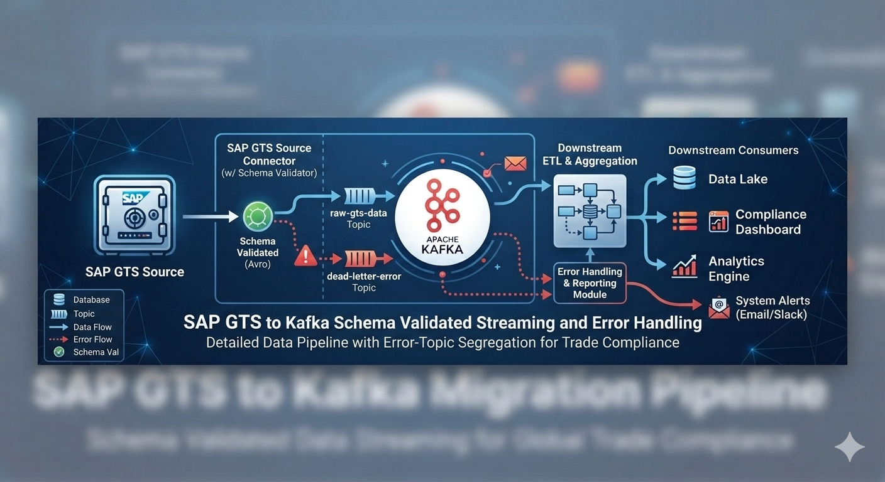
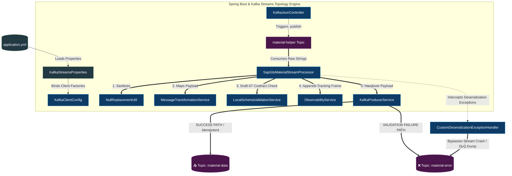

# 🚀 Enterprise SAP-GTS Data Migration Pipeline (Kafka Streams)




A production-ready data migration pipeline that 
* ingests raw, nested SAP GTS Material Master records, 
* transforms legacy formats, validates contracts natively in memory, 
* and routes clean data payloads down into an active cloud-managed infrastructure.

---

## 🗺️ PIPELINE DATA LIFECYCLE MECHANICS



***

### 📂 Clean Code Reference Links
Lookup reference matrix for architectural patterns:

| Architectural Pattern | Core Kafka / Spring Concept | 📂 Code Reference Link |
| :--- | :--- | :--- |
| **Stateless Topology Orchestration** | Inline functional record processing loop avoiding local storage directory disk overhead. | [SapGtsMaterialStreamProcessor.java](./src/main/java/com/venky/demos/kstream/processors/SapGtsMaterialStreamProcessor.java) |
| **Edge Error Boundary Exception** | Byte-level consumer deserialization trap ensuring persistent cluster thread lifecycles. | [CustomDeserializationExceptionHandler.java](./src/main/java/com/venky/demos/kstream/CustomDeserializationExceptionHandler.java) |
| **Offline Schema Interceptor** | Local JSON draft-07 contract rule validator executing zero-network RAM assertions. | [LocalSchemaValidationService.java](./src/main/java/com/venky/demos/kstream/service/LocalSchemaValidationService.java) |
| **Traceability Metadata Enrichment** | Context tracking state framework injector emitting operational system parameters. | [ObservabilityService.java](./src/main/java/com/venky/demos/kstream/service/ObservabilityService.java) |

Verify the ingest gateway is running locally by pushing an enterprise validation command via terminal or Postman:
```text
http://localhost:8080/api/kafka/publish
```

---

## 🛠️ 1. Design Patterns & SOLID Implementation

* * **Strategy Pattern (`KafkaClientConfig`)**: Utilizes structural parameter injection blocks to cleanly swap core network communication configurations without altering client-facing calling code. See implementation details in [KafkaClientConfig.java](./src/main/java/com/venky/demos/kstream/config/KafkaClientConfig.java).
* **Template Pattern (`SapGtsMaterialStreamProcessor`)**: Enforces a strict, step-by-step pipeline execution sequence (Sanitize ➡️ Transform ➡️ Validate ➡️ Enrich ➡️ Route). Look at the core orchestration engine flow inside [SapGtsMaterialStreamProcessor.java](./src/main/java/com/venky/demos/kstream/processors/SapGtsMaterialStreamProcessor.java).
* **Dependency Injection Pattern**: Decouples data processing, mapping, and destination publishing concerns completely by relying on container-managed object graph wirings.

## 2. SOLID Design Principles Achieved

* **S - Single Responsibility Principle (SRP)**:
  * `MessageTransformationService` modifies only business string payloads. Review the data mapping algorithm inside [MessageTransformationService.java](./src/main/java/com/venky/demos/kstream/service/MessageTransformationService.java).
  * `LocalSchemaValidationService` asserts only document structure validity. Review the contract parsing engine logic inside [LocalSchemaValidationService.java](./src/main/java/com/venky/demos/kstream/service/LocalSchemaValidationService.java).
* **O - Open-Closed Principle (OCP)**: Adding a new data format conversion rule requires modifications solely within the mapping service boundaries without disrupting the overarching streaming architecture graph.
* **D - Dependency Inversion Principle (DIP)**: Streaming nodes depend directly on decoupled spring service interfaces rather than binding hardcoded components directly inside execution loops.

## 3. Functional Java Core & Stream Features Used

* **Reflective Runtime Inspection**: Implements structural class scanners inside `NullReplacementUtil` to convert unset properties into clean string elements via custom loops. See reflection loops inside [NullReplacementUtil.java](./src/main/java/com/venky/demos/kstream/util/NullReplacementUtil.java).
* **Non-Blocking Promise Hooks**: Leverages modern functional completion futures inside `KafkaProducerService` to capture background broker acknowledgement parameters asynchronously. See the callback handlers inside [KafkaProducerService.java](./src/main/java/com/venky/demos/kstream/service/KafkaProducerService.java).

---

## 🍃 Spring Boot Production Mechanics Reference

The system optimizes infrastructure memory usage by utilizing explicit configuration management bindings.

| Advanced Annotation / Hook | 💡 Architectural Purpose (One-Liner Explanation) | 📂 File Link |
| :--- | :--- | :--- |
| `@EnableConfigurationProperties` | Directly exposes structured metadata classes to the context without creating parsing overhead. | [KstreamApplication.java](./src/main/java/com/venky/demos/kstream/KstreamApplication.java) |
| `@ConfigurationProperties` | Binds flat and nested configuration hierarchies safely into strongly-typed parameter schemas. | [KafkaStreamsProperties.java](./src/main/java/com/venky/demos/kstream/config/KafkaStreamsProperties.java) |
| `@Qualifier` | Bypasses general bean type matching to safely inject a specific authenticated endpoint instance out of the central context pool. | [KafkaProducerService.java](./src/main/java/com/venky/demos/kstream/service/KafkaProducerService.java) |
| `excludeName` | Disables automated spring connection listeners on boot to stop default lookups targeting `localhost:9092`. | [KstreamApplication.java](./src/main/java/com/venky/demos/kstream/KstreamApplication.java) |

### Framework Execution Mechanics
1. **Properties Separation in Action:** Removing the duplicate annotation inside [KafkaStreamsProperties.java](./src/main/java/com/venky/demos/kstream/config/KafkaStreamsProperties.java) prevents context collisions, allowing your custom configuration bean to handle mapping parsing cleanly.
2. **Dynamic Protocol Fallbacks:** If the system is deployed locally, properties fall back natively to `PLAINTEXT` via [application.yml](./src/main/resources/application.yml). If deployed to cloud testbeds, passing explicit variable strings shifts your factories instantly to use `SASL_SSL` and `SCRAM-SHA-256`.

---

## 🧠 Production Kafka Practices Reference (With Line Identifiers)

### 1. High-Value Message Delivery Guarantees
* Activates exact partition log delivery assurances by enforcing a strict transactional handshake contract.
* See `ENABLE_IDEMPOTENCE_CONFIG` configuration step inside [KafkaClientConfig.java](./src/main/java/com/venky/demos/kstream/config/KafkaClientConfig.java) for best-effort idempotency configurations enablement.
* See `ACKS_CONFIG` configuration step inside [KafkaClientConfig.java](./src/main/java/com/venky/demos/kstream/config/KafkaClientConfig.java) for absolute broker synchronization confirmations.

### 2. Boundary Poison-Pill Resilience
* Intercepts unparseable byte streams at the network ingress before they crash active consumer partition group ownership maps.
* See the standalone configuration block inside [CustomDeserializationExceptionHandler.java](./src/main/java/com/venky/demos/kstream/CustomDeserializationExceptionHandler.java) for the custom programmatic configuration hook block extracting underlying server configurations.
* See the handling method return signature inside [CustomDeserializationExceptionHandler.java](./src/main/java/com/venky/demos/kstream/CustomDeserializationExceptionHandler.java) for the explicit bypass return signal (`DeserializationHandlerResponse.CONTINUE`).

### 3. Resource-Friendly Stateless Processing Topologies
* Prevents data storage replication allocation blocks on multi-tenant shared nodes by implementing custom stateless consumer loops.
* See the ingestion point stream setup inside [SapGtsMaterialStreamProcessor.java](./src/main/java/com/venky/demos/kstream/processors/SapGtsMaterialStreamProcessor.java) for the streaming ingestion driver method boundary (`sourceStream.foreach(...)`).

***
