## 🚀 Enterprise SAP-GTS Data Migration Pipeline (Kafka Streams)

A real-time data migration pipeline built to ingest SAP Material Master records, transform legacy dates/arrays into modern data formats and validate payload schemas natively. 
It handles edge-case failures without breaking stream topologies.
This project demonstrates an advanced architectural shift from traditional heavy, stateful streaming models to a lightweight, highly resilient stateless event-driven pattern.

graph TD classDef folder fill:#2d3748,stroke:#4a5568,stroke-width:2px,color:#fff,stroke-dasharray: 5 5; classDef file fill:#1a202c,stroke:#3182ce,stroke-width:1.5px,color:#e2e8f0; classDef topic fill:#744210,stroke:#d69e2e,stroke-width:2px,color:#fff; classDef client fill:#234e52,stroke:#319795,stroke-width:1.5px,color:#fff;

```mermaid
graph TD
Client([Postman / cURL Request]) -- "HTTP POST /api/kafka/publish" --> KafkaJsonController

subgraph Project_Root ["📂 src/main/java/com/venky/demos/kstream/"]
    KstreamApplication[📄 KstreamApplication.java]:::file
    CustomDeserializationExceptionHandler[📄 CustomDeserializationExceptionHandler.java]:::file

    subgraph Config_Dir ["📂 config /"]
        KafkaStreamsProperties[📄 KafkaStreamsProperties.java]:::file
        KafkaStreamsConfig[📄 KafkaStreamsConfig.java]:::file
        KafkaProducerConfig[📄 KafkaProducerConfig.java]:::file
    end

    subgraph Controller_Dir ["📂 controller /"]
        KafkaJsonController[📄 KafkaJsonController.java]:::file
    end

    subgraph Processors_Dir ["📂 processors /"]
        SapGtsMaterialStreamProcessor[📄 SapGtsMaterialStreamProcessor.java]:::file
    end

    subgraph Service_Dir ["📂 service /"]
        KafkaProducerService[📄 KafkaProducerService.java]:::file
        MessageTransformationService[📄 MessageTransformationService.java]:::file
        LocalSchemaValidationService[📄 LocalSchemaValidationService.java]:::file
        ObservabilityService[📄 ObservabilityService.java]:::file
        ObservabilityEnrichmentService[📄 ObservabilityEnrichmentService.java]:::file
    end

    subgraph Model_Dir ["📂 model /"]
        ObservabilityPayload[📄 ObservabilityPayload.java]:::file
        ObservabilityHeader[📄 ObservabilityHeader.java]:::file
        ObservabilityLine[📄 ObservabilityLine.java]:::file
        ObservabilityError[📄 ObservabilityError.java]:::file
    end

    subgraph Util_Dir ["📂 util /"]
        NullReplacementUtil[📄 NullReplacementUtil.java]:::file
    end
end

subgraph Resources_Root ["📂 src/main/resources/"]
    AppYaml[📄 application.yml]:::file
    subgraph Schema_Dir ["📂 schema /"]
        SchemaJson[📄 schema.json]:::file
    end
end

subgraph Aiven_Kafka_Cluster ["☁️ Cloud Aiven Kafka Cluster"]
    HelperTopic[📥 Topic: material-helper]:::topic
    DataTopic[📤 Topic: material-data]:::topic
    ErrorTopic[❌ Topic: material-error]:::topic
end

KafkaJsonController -.-> KafkaStreamsProperties
KafkaJsonController --> |"Dispatches Raw SAP Payload String"| HelperTopic

HelperTopic ==> |"Consumes Stream Context Records"| SapGtsMaterialStreamProcessor
SapGtsMaterialStreamProcessor -.-> CustomDeserializationExceptionHandler
CustomDeserializationExceptionHandler ==> |"Routes Raw Corrupted Bytes"| ErrorTopic

SapGtsMaterialStreamProcessor ==> |"Step 1: Sanitize Strings"| NullReplacementUtil
SapGtsMaterialStreamProcessor ==> |"Step 2: Parse and Map Data"| MessageTransformationService
SapGtsMaterialStreamProcessor ==> |"Step 3: Check Local Specifications"| LocalSchemaValidationService
LocalSchemaValidationService -.-> SchemaJson

SapGtsMaterialStreamProcessor ==> |"Step 4: Inject Trace Frames"| ObservabilityService
ObservabilityService -.-> ObservabilityPayload

SapGtsMaterialStreamProcessor ==> |"Step 5: Handover Formatted String"| KafkaProducerService
KafkaProducerService -.-> KafkaProducerConfig

KafkaProducerService ===> |"SUCCESS PATH"| DataTopic
KafkaProducerService ===> |"VALIDATION FAILURE PATH"| ErrorTopic

class Project_Root,Config_Dir,Controller_Dir,Processors_Dir,Service_Dir,Model_Dir,Util_Dir,Resources_Root,Schema_Dir folder;
```

------------------------------
## 🗺️ Architectural Concept Map
(🎨 [Placeholder: docs/assets/kafka-architecture.png] - Coming soon: Visual breakdown of Producers, Consumer Groups, and Partition Routing strategies).

[ SAP GTS Source ]
│
▼ (HTTPS / CPI)
┌───────────────────────┐
│  KafkaJsonController  │ ──► Publishes to raw data landing pad
└───────────────────────┘
│
▼
📥 Topic: material-helper  (Partitioned Raw Log)
│
├─── [ Valid Payload ] ──► Transform ──► Validate ──► 📤 Topic: material-data
│
└─── [ Poison Pill / Exception ] ────────────────────► ❌ Topic: material-error (DLQ)

------------------------------
## 🎯 Strategic Business Impact 

* Zero System Downtime: Custom deserialization safety layers ensure poison pills (corrupted bits/bad frames) are caught at the boundary, ensuring a single bad record never stalls global enterprise data sync loops.
* Cloud Resource Optimization: By shifting processing models to a stateless approach, this application operates completely free of local disk overhead (RocksDB), cutting cloud infrastructure costs while avoiding multi-tenant storage policies.
* Traceability and Observability: Injects standardized tracking blocks (stageCode, status) directly into data payloads, enabling real-time monitoring of multi-million record migration cycles via Datadog or ELK.

------------------------------
## 🛠️ Deep-Dive Technical Recipes 
This project serves as a concrete engineering blueprint for advanced Kafka and Spring patterns. Use the quick-links below to grab the exact implementation code.
## 1. Robust SASL/SCRAM Connection Blueprints
Connecting securely to managed cloud brokers (like Aiven) over SASL_SSL using encrypted credentials requires custom configuration properties to prevent hardcoded credential issues.

* Implementation Reference: KafkaStreamsProperties.java
* Configuration Blueprint: application.yml

## 2. Base Configurations & Dynamic Scenario Augmentation
To share a uniform base environment layout (Brokers, SSL protocols, JAAS login templates) across multiple modules while augmenting configurations for specific workloads (e.g., enabling strict Idempotency for high-value pipelines), use standalone producer and stream configuration factories.

* Streams Bean Mapping: KafkaStreamsConfig.java
* Augmented Standalone Producer Factory: KafkaProducerConfig.java (Enforces ENABLE_IDEMPOTENCE_CONFIG = true and ACKS_CONFIG = all for critical message delivery consistency).

## 3. Edge Safety Deserialization Handlers (Dead Letter Queues)
If a source system drops unparseable junk bytes (broken serialization strings) into your pipeline, Kafka Streams' default behavior is to panic and shut down the engine. This handler intercepts bad bytes right at the boundary, copies them onto an audit DLQ topic, and triggers a CONTINUE signal to keep the consumer group alive.

* Implementation Reference: CustomDeserializationExceptionHandler.java

## 4. Highly Resilient Stateless Processing Topologies
To prevent policy violations on multi-tenant brokers with low topic thresholds, this template avoids using intermediate stateful storage handlers (like RocksDB or state stores) by orchestrating complex transformation and error-handling pipelines inside a stateless execution loop.

* Core Stream Processor Logic: SapGtsMaterialStreamProcessor.java

------------------------------
## 📚 Core Kafka Core Concepts Implemented

* Consumer Group Coordination: Uses unique application.id strings to establish isolated consumer groups on your broker, automatically sharing partition ownership across multiple application instances for horizontal scale.
* Stateless vs Stateful Topologies: Eliminates changelog and repartitioning topics by utilizing inline processing functions, avoiding storage overhead and ensuring fast stream consumer rebalances.
* Dead Letter Queue (DLQ) Architecture: Implements a multi-layered DLQ strategy. It uses low-level byte-traps for corrupted schemas and high-level routing handlers for logical exceptions, ensuring complete preservation of data context during system anomalies.
* Idempotent Network Handlers: Configures producer factories with transactional sequence tracking parameters to guarantee exactly-once network deliveries, preventing duplicate records during network retries.

------------------------------
## ⚡ Quick Start Local Testing Sequence
## 1. Spin up Local Environment Credentials
Cloud credentials and local truststore certificates are mapped to the proper paths inside your local property file:

# Environment properties are properly secured via shell variables
# Verify variables are visible to the process
$env:KAFKA_TRUSTSTORE_PASSWORD
$env:KAFKA_SASL_PASSWORD

## 2. Compile and Verify the Project Code
Run a full verification and compilation build to ensure the data models, Lombok annotations, and open-source JSON validators are securely indexed:
[payload](src/main/resources/payload)
./gradlew clean build -x test --no-daemon

## 3. Initiate the Stream Processing Application
Launch the application context locally on your laptop:

./gradlew bootRun

## 4. Response from aiven console under topics
{
schemaVersion:
1.0
eventType:
MaterialCreated
eventId:
evt_9876543210_abc
eventTimestamp:
2026-07-25T18:05:23Z
data:

{
materialNumber:
MAT-99042-X
baseUnitOfMeasure:
PC
industrySector:
M
materialType:
ROH
descriptions:

[ ... ] 2 items
crossPlantStatus:
01
gtsAttributes:

{ ... } 5 items
plantData:

[ ... ] 1 items
}
}
